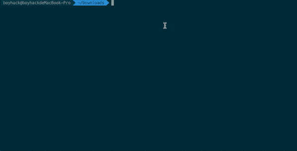

# KSubdomain: Ultra-Fast Stateless Subdomain Enumeration Tool

[](https://github.com/boy-hack/ksubdomain/releases) [](https://goreportcard.com/report/github.com/boy-hack/ksubdomain) [](https://github.com/boy-hack/ksubdomain/blob/main/LICENSE)


**KSubdomain is a stateless subdomain enumeration tool that delivers unprecedented scanning speed with extremely low memory consumption.** Say goodbye to traditional tool bottlenecks and experience lightning-fast DNS queries with a reliable state table retransmission mechanism ensuring result completeness. KSubdomain supports Windows, Linux, and macOS, making it ideal for large-scale DNS asset discovery.



## 🚀 Core Advantages

*   **Lightning-Fast Speed:** Utilizing stateless scanning technology, it directly operates network adapters for raw socket packet sending, bypassing the system kernel's network protocol stack to achieve astonishing packet rates. Use the `test` command to probe your local network adapter's maximum sending speed.
*   **Extremely Low Resource Consumption:** Innovative memory management mechanisms, including object pools and global memory pools, significantly reduce memory allocation and GC pressure, maintaining low memory footprint even when processing massive domain lists.
*   **Stateless Design:** Similar to Masscan's stateless scanning, it doesn't maintain a state table from the system, building a lightweight state table instead, fundamentally solving traditional scanning tools' memory bottlenecks and performance limitations, as well as stateless scanning packet loss issues.
*   **Reliable Retransmission:** Built-in intelligent retransmission mechanism effectively handles network jitter and packet loss, ensuring result accuracy and completeness.
*   **Cross-Platform Support:** Perfect compatibility with Windows, Linux, and macOS.
*   **Easy to Use:** Simple command-line interface, providing verify and enum modes, with built-in common dictionaries.

## ⚡ Performance Highlights

KSubdomain far exceeds similar tools in speed and efficiency. Here's a comparison test using a 100k dictionary in a 4-core CPU, 5M bandwidth network environment:

| Tool         | Mode   | Method       | Command                                                                    | Time           | Success | Notes                     |
| ------------ | ------ | ------------ | -------------------------------------------------------------------------- | -------------- | ------- | ------------------------- |
| **KSubdomain** | Verify | pcap network | `time ./ksubdomain v -b 5m -f d2.txt -o k.txt -r dns.txt --retry 3 --np`  | **~30 sec**    | 1397    | `--np` disables real-time printing |
| massdns      | Verify | pcap/socket  | `time ./massdns -r dns.txt -t A -w m.txt d2.txt --root -o L`                 | ~3 min 29 sec  | 1396    |                           |
| dnsx         | Verify | socket       | `time ./dnsx -a -o d.txt -r dns.txt -l d2.txt -retry 3 -t 5000`             | ~5 min 26 sec  | 1396    | `-t 5000` sets 5000 concurrent |

**Conclusion:** KSubdomain is **7x faster** than massdns and **10x faster** than dnsx!

## 🛠️ Technical Innovations (v2.0)

KSubdomain 2.0 introduces multiple underlying optimizations to further squeeze performance potential:

1.  **State Table Optimization:**
    *   **Sharded Locks:** Replaces global locks, significantly reducing lock contention and improving concurrent write efficiency.
    *   **Efficient Hashing:** Optimizes key-value storage, evenly distributing domains, and enhancing lookup speed.
2.  **Packet Sending Optimization:**
    *   **Object Pools:** Reuses DNS packet structures, reducing memory allocation and GC overhead.
    *   **Template Caching:** Reuses Ethernet/IP/UDP layer data for the same DNS servers, reducing redundant construction overhead.
    *   **Parallel Sending:** Multi-goroutine parallel packet sending, fully utilizing multi-core CPU performance.
    *   **Batch Processing:** Batch sends domain requests, reducing system calls and context switching.
3.  **Receiving Optimization:**
    *   **Object Pools:** Reuses parsers and buffers, reducing memory consumption.
    *   **Parallel Processing Pipeline:** Receive → Parse → Process three-stage parallelism, improving processing pipeline efficiency.
    *   **Buffer Optimization:** Increases internal Channel buffer size, avoiding processing blockage.
    *   **Efficient Filtering:** Optimizes BPF filter rules and packet processing logic, quickly discarding invalid packets.
4.  **Memory Management Optimization:**
    *   **Global Memory Pool:** Introduces `sync.Pool` to manage common data structures, reducing memory allocation and fragmentation.
    *   **Structure Reuse:** Reuses DNS query structures and serialization buffers.
5.  **Architecture and Concurrency Optimization:**
    *   **Dynamic Concurrency:** Automatically adjusts goroutine count based on CPU cores.
    *   **Efficient Random Numbers:** Uses more performant random number generators.
    *   **Adaptive Rate:** Dynamically adjusts packet sending rate based on network conditions and system load.
    *   **Batch Loading:** Batch loads and processes domains, reducing per-domain processing overhead.

## 📦 Installation

### Download Binary

Please download the pre-compiled binary file corresponding to your system from the [Releases](https://github.com/boy-hack/ksubdomain/releases) page.

1.  **Download:** Get the latest version for your OS (Windows, Linux, macOS).
2.  **Install `libpcap` Dependency:**
    *   **Windows:** Download and install [Npcap](https://npcap.com/).
    *   **Linux:** Usually pre-installed. If not, install `libpcap-dev` or `libcap-devel`.
    *   **macOS:** Pre-installed.
3.  **Grant Execute Permission (Linux/macOS):** `chmod +x ksubdomain`
4.  **Run!**

### Build from Source

Ensure you have Go 1.23+ and `libpcap` environment installed.

```bash
git clone https://github.com/boy-hack/ksubdomain.git
cd ksubdomain
go build -o ksubdomain ./cmd/ksubdomain
```

## 📖 Usage

```bash
KSubdomain - Ultra-Fast Stateless Subdomain Enumeration Tool

Usage:
  ksubdomain [global options] command [command options] [arguments...]

Version:
  Check version: ksubdomain --version

Commands:
  enum, e    Enumeration mode: Provide root domain for brute-force
  verify, v  Verification mode: Provide domain list for verification
  test       Test local network adapter's maximum packet sending speed
  help, h    Show command list or help for a command

Global Options:
  --help, -h     Show help (default: false)
  --version, -v  Print version (default: false)
```

### Verification Mode

Verification mode quickly checks the alive status of provided domain lists.

```bash
./ksubdomain verify -h # or ksubdomain v

OPTIONS:
   --filename value, -f value       Domain file path
   --domain value, -d value         Domain
   --band value, -b value           Bandwidth downstream speed, e.g., 5M, 5K, 5G (default: "3m")
   --resolvers value, -r value      DNS servers (uses built-in DNS by default)
   --output value, -o value         Output filename
   --output-type value, --oy value  Output file type: json, txt, csv, jsonl (default: "txt")
   --silent                         Only output domains to screen (default: false)
   --retry value                    Retry count, -1 for infinite retry (default: 3)
   --timeout value                  Timeout in seconds (default: 6)
   --stdin                          Accept stdin input (default: false)
   --not-print, --np                Don't print domain results (default: false)
   --eth value, -e value            Specify network adapter name
   --wild-filter-mode value         Wildcard filtering mode: basic, advanced, none (default: "none")
   --predict                        Enable domain prediction mode (default: false)
   --only-domain, --od              Only output domains, no IPs (default: false)
   --help, -h                       Show help (default: false)

# Examples:
# Verify multiple domains
./ksubdomain v -d xx1.example.com -d xx2.example.com

# Read domains from file and save to output.txt
./ksubdomain v -f domains.txt -o output.txt

# Read from stdin with 10M bandwidth limit
cat domains.txt | ./ksubdomain v --stdin -b 10M

# Enable prediction mode with advanced wildcard filtering, save as CSV
./ksubdomain v -f domains.txt --predict --wild-filter-mode advanced --oy csv -o output.csv

# JSONL format for tool chaining
./ksubdomain v -f domains.txt --oy jsonl | jq '.domain'
```

### Enumeration Mode

Enumeration mode brute-forces subdomains under specified domains based on dictionaries and prediction algorithms.

```bash
./ksubdomain enum -h # or ksubdomain e

OPTIONS:
   --domain value, -d value         Domain
   --band value, -b value           Bandwidth downstream speed (default: "3m")
   --resolvers value, -r value      DNS servers
   --output value, -o value         Output filename
   --output-type value, --oy value  Output type: json, txt, csv, jsonl (default: "txt")
   --silent                         Only output domains (default: false)
   --retry value                    Retry count (default: 3)
   --timeout value                  Timeout in seconds (default: 6)
   --stdin                          Accept stdin input (default: false)
   --not-print, --np                Don't print results (default: false)
   --eth value, -e value            Specify network adapter
   --wild-filter-mode value         Wildcard filter mode (default: "none")
   --predict                        Enable prediction mode (default: false)
   --only-domain, --od              Only output domains (default: false)
   --filename value, -f value       Dictionary path
   --ns                             Read domain NS records and add to resolvers (default: false)
   --help, -h                       Show help (default: false)

# Examples:
# Enumerate multiple domains
./ksubdomain e -d example.com -d hacker.com

# Use dictionary file
./ksubdomain e -d example.com -f subdomain.txt -o output.txt

# Read from stdin with 10M bandwidth
cat domains.txt | ./ksubdomain e --stdin -b 10M

# Enable prediction with advanced wildcard filtering
./ksubdomain e -d example.com --predict --wild-filter-mode advanced --oy jsonl
```

## ✨ Features & Tips

*   **Automatic Bandwidth Adaptation:** Just specify your public network downstream bandwidth with `-b` (e.g., `-b 10m`), and KSubdomain automatically optimizes packet sending rate.
*   **Test Maximum Rate:** Run `./ksubdomain test` to test maximum theoretical packet rate in current environment.
*   **Automatic Network Adapter Detection:** KSubdomain auto-detects available network adapters.
*   **Progress Display:** Real-time progress bar showing Success / Sent / Queue / Received / Failed / Time Elapsed.
*   **Parameter Tuning:** Adjust `--retry` and `--timeout` based on network quality and target domain count for best results. When `--retry` is -1, it will retry indefinitely until all requests succeed or timeout.
*   **Multiple Output Formats:** Supports `txt` (real-time), `json` (on completion), `csv` (on completion), `jsonl` (streaming). Specify with `-o` and file extension (e.g., `result.json`).
*   **Environment Variables:**
    *   `KSubdomainConfig`: Specify config file path.

## 🔗 Integration Examples

### With httpx
```bash
./ksubdomain enum -d example.com --od | httpx -silent
```

### With nuclei
```bash
./ksubdomain enum -d example.com --od | nuclei -l /dev/stdin
```

### With nmap
```bash
./ksubdomain enum -d example.com --od | nmap -iL -
```

### Streaming processing with JSONL
```bash
./ksubdomain enum -d example.com --oy jsonl | \
  jq -r 'select(.type == "A") | .domain' | \
  httpx -silent
```

### In Python scripts
```python
import subprocess
import json

result = subprocess.run(
    ['ksubdomain', 'enum', '-d', 'example.com', '--oy', 'jsonl'],
    capture_output=True, text=True
)

for line in result.stdout.strip().split('\n'):
    data = json.loads(line)
    print(f"{data['domain']} => {data['records']}")
```

### In Go programs
```go
import "github.com/boy-hack/ksubdomain/v2/sdk"

scanner := sdk.NewScanner(&sdk.Config{
    Bandwidth: "5m",
    Retry:     3,
})

results, err := scanner.Enum("example.com")
for _, result := range results {
    fmt.Printf("%s => %s\n", result.Domain, result.IP)
}
```

## 🌟 Platform Notes

### macOS Users

macOS uses BPF (Berkeley Packet Filter) with smaller default buffers:

```bash
# Recommended: 5M bandwidth for stability
sudo ./ksubdomain e -d example.com -b 5m

# If buffer errors occur
sudo ./ksubdomain e -d example.com -b 3m --retry 10

# System tuning (optional)
sudo sysctl -w net.bpf.maxbufsize=4194304
```

### WSL/WSL2 Users

```bash
# Usually use eth0
./ksubdomain e -d example.com --eth eth0

# If network adapter is not up
sudo ip link set eth0 up
```

### Windows Users

```bash
# Must install Npcap driver first
# Download: https://npcap.com/

# Run with administrator privileges
.\ksubdomain.exe enum -d example.com
```

## 📊 Output Formats

### TXT (Default)
```
www.example.com => 93.184.216.34
mail.example.com => CNAME mail.google.com
api.example.com => 93.184.216.35
```

### JSON
```json
{
  "domains": [
    {
      "subdomain": "www.example.com",
      "answers": ["93.184.216.34"]
    }
  ]
}
```

### CSV
```csv
subdomain,type,record
www.example.com,A,93.184.216.34
mail.example.com,CNAME,mail.google.com
```

### JSONL (JSON Lines) - **New!** 🆕
```jsonl
{"domain":"www.example.com","type":"A","records":["93.184.216.34"],"timestamp":1709011200}
{"domain":"mail.example.com","type":"CNAME","records":["mail.google.com"],"timestamp":1709011201}
```

Perfect for streaming processing and tool chaining!

## 🛡️ Security & Ethics

**Responsible Use:**
*   Only scan domains you own or have permission to test
*   Respect target systems and network resources
*   Comply with local laws and regulations
*   This tool is for security research and authorized testing only

## 📚 Documentation

- [Quick Start Guide](./docs/quickstart.md)
- [API Documentation](./docs/api.md)
- [Best Practices](./docs/best-practices.md)
- [FAQ](./docs/faq.md)

## 🤝 Contributing

We welcome contributions! See [CONTRIBUTING.md](./CONTRIBUTING.md) for guidelines.

- Report bugs: [GitHub Issues](https://github.com/boy-hack/ksubdomain/issues)
- Feature requests: [GitHub Discussions](https://github.com/boy-hack/ksubdomain/discussions)
- Submit PRs: Performance improvements, bug fixes, new features all welcome!

## 💡 References

*   Original KSubdomain: [https://github.com/knownsec/ksubdomain](https://github.com/knownsec/ksubdomain)
*   From Masscan/Zmap Analysis to Practice: [https://paper.seebug.org/1052/](https://paper.seebug.org/1052/)
*   KSubdomain Stateless Tool Introduction: [https://paper.seebug.org/1325/](https://paper.seebug.org/1325/)

## 📜 License

KSubdomain is released under the MIT License. See [LICENSE](LICENSE) for details.

## 🙏 Acknowledgments

Special thanks to all contributors and the open-source community!

---

**Star ⭐ this repo if you find it useful!**

Made with ❤️ by the KSubdomain Team
